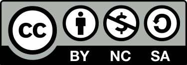

# Bringing AI Fairness into classrooms
AI has become an integral part of our daily lives, influencing various systems that often make impactful decisions affecting human lives. Despite aspirations for "fairer" and "more neutral" outcomes, the responsibility of weighing ethical considerations and objectives still rests upon us humans. Therefore, it is crucial to introduce future developers and decision-makers, both teachers and students alike, to normative questions from an early stage.

Through an engaging classroom experiment featuring a simple game, we aim to raise awareness among students about the complexity and nuances of fairness. By directly involving them, we can make subtle differences in fairness perception tangible and encourage discussions. Moreover, we'll provide a contextual framework by exploring various fairness concepts, bridging the gap to real-world algorithmic implementations of fairness and highlighting the potential societal impacts of AI.

# Learning objectives:
- Heightened awareness of the relevance and challenges surrounding fairness in AI for both educators and students
- Practical understanding of fairness and unfairness through interactive experiences
- Familiarity with key terms associated with different forms of fairness, acknowledging their sometimes conflicting nature
- Integration of theoretical concepts into real-world examples, offering an optimistic outlook on the technical application of fairness principles
  
# What do I need in order to use it?
- As a teacher, you should have a basic understanding for the subtleties of fairness as well as for the mechanisms of AI models.
- The experiment involves an interactive [  Mentimeter](www.mentimeter.com) presentation (which requires a Mentimeter license) as well as some PowerPoint slides.
- To conduct the experiment in person, you need a regular die as well as a loaded die such as [this one](https://www.galerie-hunold.de/product/timm-ulrichs-glueckswuerfel/). 

# Copyright / license
This work is licensed under a Creative Commons Attribution 4.0 International License (CC BY-NC-SA 4.0).

 
As such:
### You are free to:
* Share — copy and redistribute the material in any medium or format
* Adapt — remix, transform, and build upon the material
* The licensor cannot revoke these freedoms as long as you follow the license terms.

### Under the following terms:
* Attribution — You must give appropriate credit , provide a link to the license, and indicate if changes were made . You may do so in any reasonable manner, but not in any way that suggests the licensor endorses you or your use.
* NonCommercial — You may not use the material for commercial purposes.
* ShareAlike — If you remix, transform, or build upon the material, you must distribute your contributions under the same license as the original.

# Authors, citation
Luca Deck, University of Bayreuth, Germany \
Valentin Mayer, University of Bayreuth, Germany

Cite as:\
*FairDice: An interactive lecture hall experiment to showcase the nuances of fairness, licensed under
[CC-BY-NC-SA](https://creativecommons.org/licenses/by-nc-sa/4.0/legalcode.txt),
via https://github.com/AI-for-Business/FairDice*

# DOI - code
tbd

# Contact / about us
* You can find all of our repositories [here](https://github.com/orgs/AI-for-Business/repositories).
* You can find the homepage of the project ABBA: **A**I for **B**usiness | **B**usiness for **A**I
[here](https://abba-project.de/).
* You can contact the authors by sending us an [email](mailto:abba-services@fim-rc.de).
